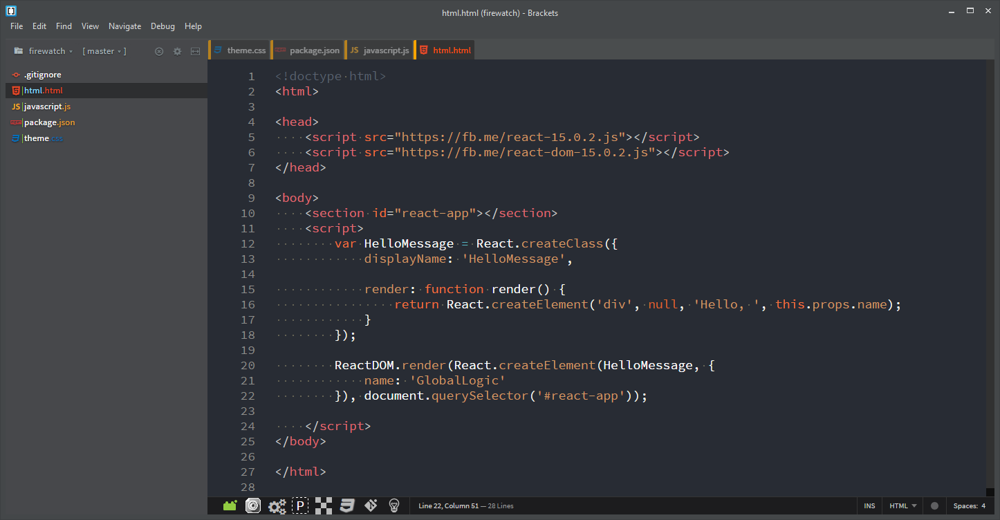
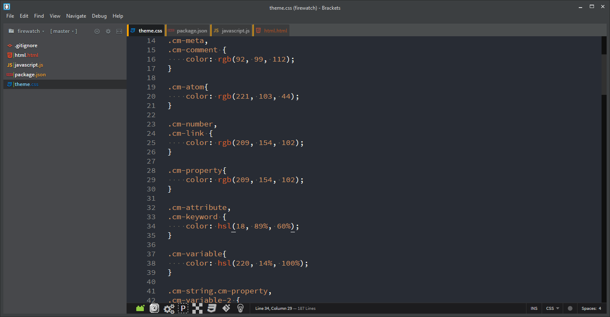
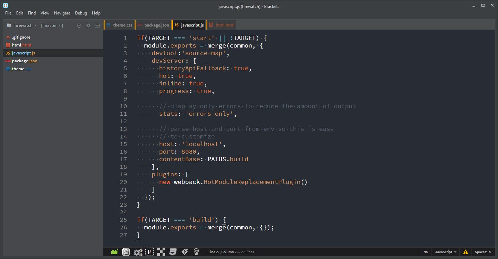

Brackets Theme: Firewatch
===

This theme is based on the color scheme from _Firewatch_ video game.

Screenshots
---

### HTML

### CSS

### JavaScript

Installation
---

This extension requires Brackets Release 1.0 or newer.

1. Open Brackets
2. Open the Extension Manager
3. Switch to "Themes" tab
4. Search for "Firewatch"
5. Click "Install"

License
---

The MIT License. Read [LICENSE](LICENSE) for further information.